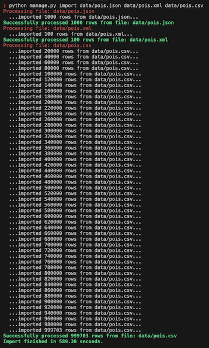

# SearchSmartly PoI Importer

## Prerequisites

Ensure you have the following installed:

- **Docker and Docker Compose**: For running the PostgreSQL/PostGIS database.
- **Pipenv**: For managing Python dependencies.
- **GDAL**: A required library for GeoDjango. You can install it using Homebrew on macOS (`brew install gdal`) or your system's package manager on Linux.

## Getting Started

Follow these steps to set up and run the project locally:

### 1. Set Up the Environment

First, install the required Python packages using Pipenv:

```bash
pipenv install
```

This will create a virtual environment and install all the dependencies listed in the `Pipfile`.

### 2. Start the Database

The project uses a PostgreSQL database with the PostGIS extension, managed via Docker. To start the database container, run:

```bash
docker-compose up -d
```

The database will be available on `localhost:5434`. Database credentials also available in the `docker-compose.yaml`

### 3. Spawn Virtualenv

```bash
cd searchsmartly_be
pipenv shell
```

### 3. Apply Migrations

Once the database is running, apply the Django migrations to set up the necessary tables:

```bash
python manage.py migrate
```

### 4. Create a Superuser

To access the Django Admin panel, you'll need a superuser account. Create one with the following command and follow the prompts:

```bash
python manage.py createsuperuser
```

### 5. Run the Development Server

Finally, start the Django development server:

```bash
python manage.py runserver
```

The application will be running at `http://127.0.0.1:8000/`. You can access the Django Admin panel at `http://127.0.0.1:8000/admin/` and log in with the superuser credentials you created.

## Import Data

The project includes a management command to import PoI data from CSV, JSON and XML files. The sample data files are located in the `searchsmartly_be/data` directory, the CSV file is excluded from the repo because too big.

To import the data, run the `import` command, followed by the paths to the files you want to import. You can specify one or more files at once.

**Example:**

```bash
python manage.py import data/pois.json data/pois.xml
```

The command will process each file, parse the PoI data, and save it to the database. It will display progress and success messages in the console.



**Note:**

Some line in csv file are problematic, it looks like it 2 records but actually 1 record having multiline. That's the reason total number of line in CSV != processed row.


## Running Test

There are 2 available integrations test using Django test suite, it can be run by: 

```bash
python manage.py test
```

## Notable Design Patterns & Implementation Details

- **Memory-Efficient Parsing**: The `import` command processes large files line-by-line using Python generators (`yield`). To ensures small, constant memory footprint, allowing it to handle large files.

- **High-Throughput Ingestion**: It uses Django's `bulk_create()` to insert data in large batches (10,000 records at a time). This minimizes database round-trips.

- **Extensible Parser Design (Strategy & Factory)**: The project uses the Strategy and Factory patterns to support different file formats (`.csv`, `.json`, `.xml`). A factory selects the appropriate parser based on the file extension. This makes it easy to add new formats without modifying the core import logic.

- **Data Integrity**: Each file is imported within an atomic transaction (`transaction.atomic()`) to either all the data from a file is imported successfully, or none of it is, preventing partial or corrupt data.

- **PostGIS**: The project uses PostGIS to align with production environments where geospatial queries are common. While standard PostgreSQL would work for this specific task, I would like to try and learn to use PostGIS.

- **Precomputed Average Ratings**: During the import process, the average rating for each PoI is calculated on-the-fly and stored in the database as a dedicated field (`average_rating`). So that subsequent read operations do not need to compute the average on the fly, optimized for read-heavy workloads.

## Assumptions

- **External ID and file path are unique**: For each imported file, external IDs are unique. This makes the import process idempotent.
- **Exact matches for Admin searches**: Search by ID & External ID only works with exact macthes in the Django Admin. This makes search a bit faster.


## Potential Improvements

- **More test cases**: Add tests for edge cases like missing fields, malformed data.

- **Python's multiprocessing**: Use Python's multiprocessing to parse multiple files at once, or probably using queue and multiple workers in distributed system. The database will still be the main bottleneck, but parsing will be faster overall.

